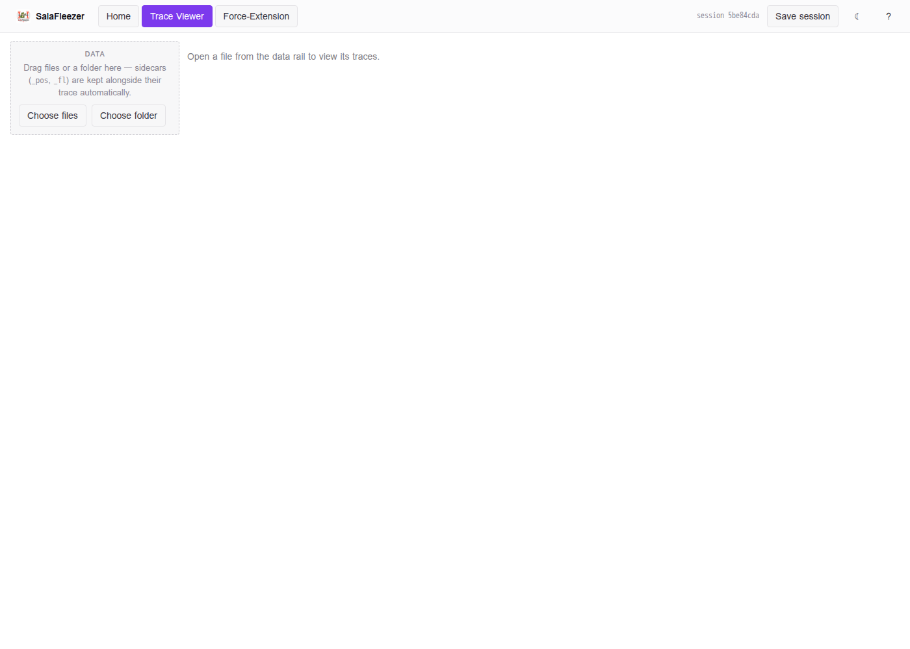
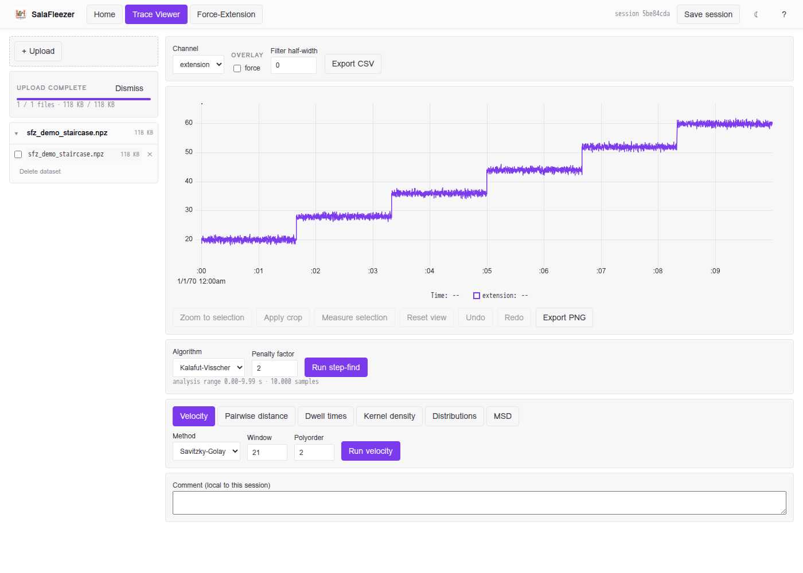
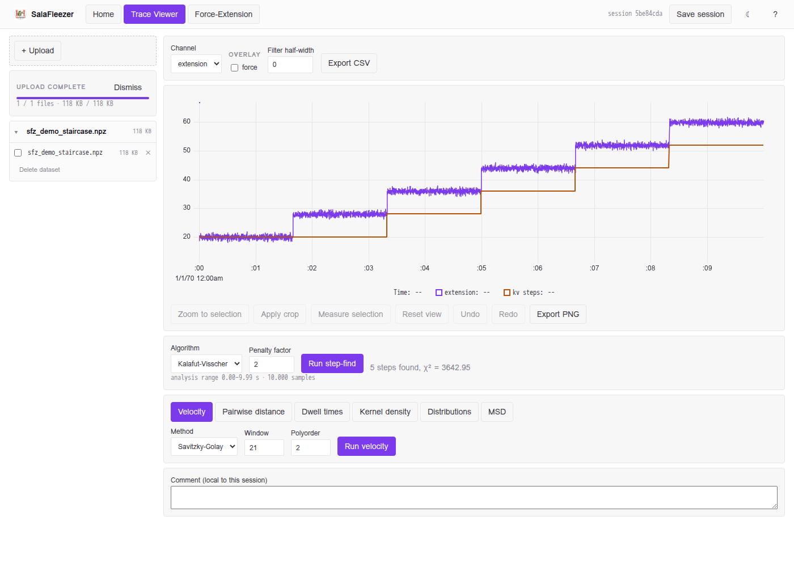
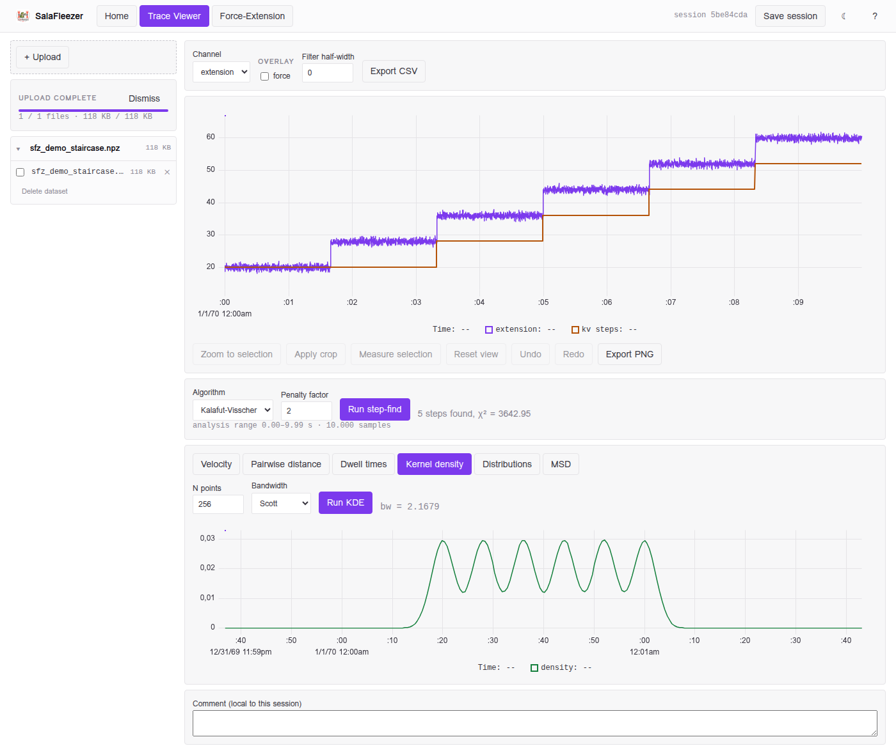
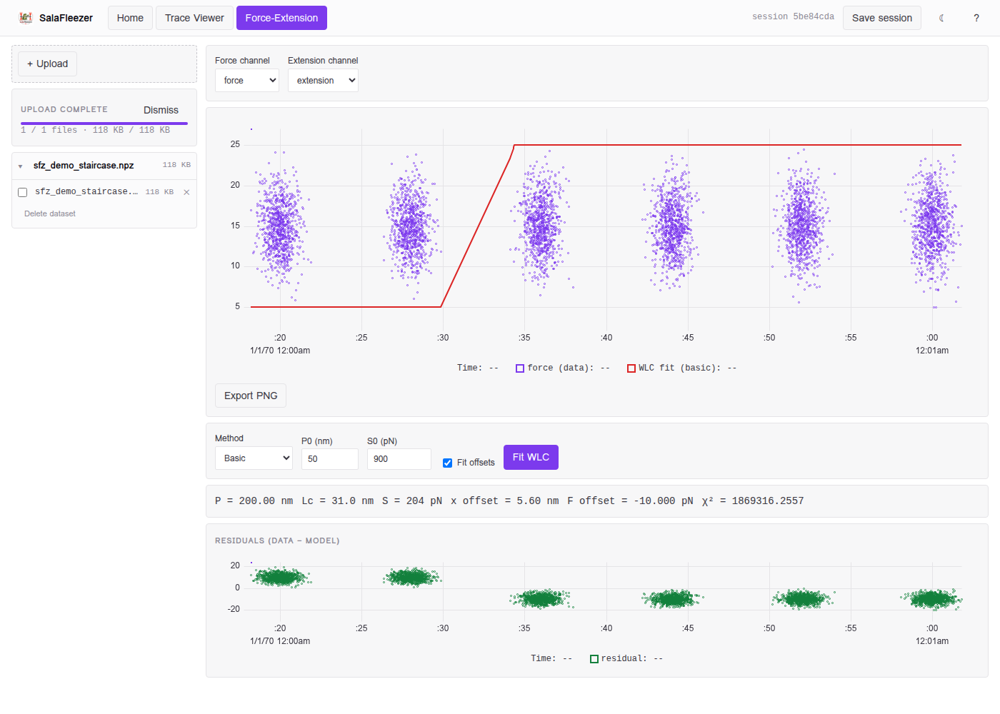
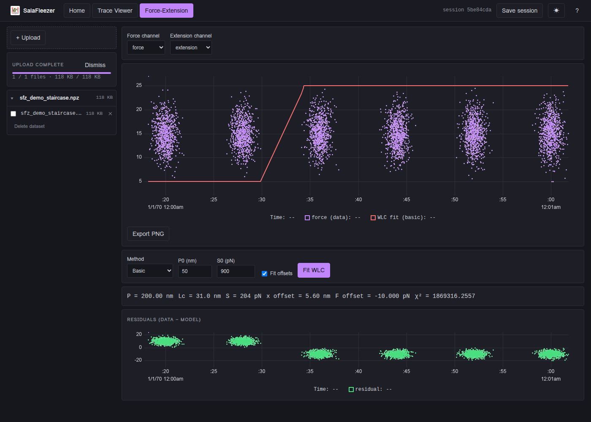

# GUI walkthrough

`sfz gui` launches a FastAPI backend and opens a browser at the built Svelte SPA. Everything
below is a real screenshot of the actual running app (synthetic staircase test data, not real
instrument output — the shapes are what matter here, not the specific numbers).

On a source checkout, the SPA has to be built once with Node before `sfz gui` has anything to
serve — see [Building the web GUI frontend](installation.md#building-the-web-gui-frontend). If
you skip it, the server still starts fine but the browser tab stays blank.

## Opening a file

Drag files or a folder onto the page — or use the **Choose files** / **Choose folder** buttons
in the data rail — and they upload straight into your own workspace on the server. No server
filesystem path to know or type, and no configuration required to get started. `.dat`, `.h5`,
and `.npz` are all supported (see [Data formats](data-formats.md); `.mat` is currently
write-only, produced by `sfz process --save-format mat`, not readable by the GUI).

Uploading a **folder** (rather than a lone `.dat` file) matters for raw SalaFleezer data: each
`.dat`'s optional `_pos`/`_fl`/`_grn` sidecar files have to land next to it to be read, and the
data rail flags a trace with a missing expected sidecar so you know to re-drop the whole folder
rather than a single file. Uploaded datasets appear in the rail, grouped by folder; click a trace
to open it, or check several and click **Open N selected** to load them all (e.g. for the
cross-file Distributions comparison).

For scripted or CLI workflows where the files are already on the same host `sfz gui` runs on,
the backend still accepts an ordinary server path via the API — see `--data-root` in
[Installation](installation.md) — but that is no longer a UI affordance.

## Trace Viewer

The Trace Viewer (replacing `PhageGUIv4.m`) shows the selected channel over time. Drag on the
plot to select a range, then:

- **Zoom to selection** — narrows the view and re-fetches at finer resolution
- **Apply crop** — the same selection, sent to the backend session over the live WebSocket
- **Measure selection** — mean/std/median/min/max/duration over the range
- **Undo / Redo** — steps back and forward through your zoom/crop history
- **Export PNG** — grabs the uPlot canvas directly, or **Export CSV** for the raw data

Running **step-find** (Kalafut-Visscher or HMM — see
[Step-finding theory](../physics/step-finding.md)) overlays the detected staircase directly on
the trace:

### Analysis panels

Below the trace, six tabs each call one analysis endpoint and plot the result: Velocity,
Pairwise distance, Dwell times, Kernel density, Distributions (compares one channel's
distribution across every loaded file), and MSD. Here's Kernel density on the same staircase —
note how the density peaks line up exactly with the step levels above:

## Force-Extension viewer

The Force-Extension viewer (replacing `ForExtGUI_V2.m`) plots one channel against another —
typically force vs. extension — and fits an extensible WLC model
(see [Force & extension](../physics/force-extension.md)) with a residuals subplot underneath:

(This particular fit is nonsense — `P` is pinned at its upper bound and χ² is enormous — because
the demo data's "force" and "extension" channels are independent random noise, not a real pulling
curve. It's here to show the UI working, not to demonstrate a real fit.)

## Theming & shortcuts

Toggle dark/light with the button in the top right, or press `t`. Hover the keyboard icon (⌨)
for the full shortcut list: `1`/`2` switch views, `z`/`c`/`m`/`0` zoom/crop/measure/reset,
Ctrl/Cmd+Z / Ctrl/Cmd+Shift+Z undo/redo, Ctrl/Cmd+S saves the session.

## Sessions

**Save session** persists the loaded files' references, crops, and every cached analysis result
to disk (`~/.salafleezers/sessions/`, namespaced by user when `SFZ_TRUSTED_USER_HEADER` is
configured — see [Architecture](../developer/architecture.md#session-state-storage-auth)) —
reload the same session ID later to pick up where you left off. Files rehydrate lazily on first
access rather than all at once, so reloading a session with hundreds of files is fast even
before you've reopened any of them.
